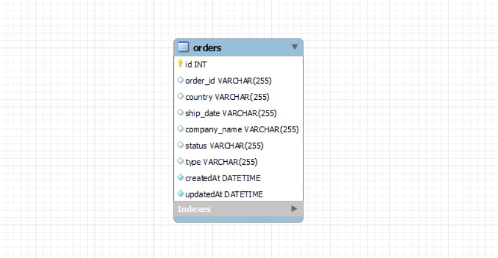

# Prueba Técnica (parte backend)

## Solicitan prueba técnica para puesto junior.

## Url de despliegue: https://ars-prueba-tecnica-backend.herokuapp.com/

## Consiste en la creación de un crud sobre la entidad Order (ver todos los orders, crear nuevo order, actualizar un order y borrar un order).
***

***

## Pre-requisitos del proyecto para hacerlo funcionar en tu equipo local:

* Instalar **Nodejs** en nuestro equipo, descargándolo de su página oficial
https://nodejs.org/

* Clonar el proyecto en nuestro equipo con git bash:
```
$git clone 'url-del-repositorio'
```

* Instalar todas las dependecias con el siguiente comando:
```
npm install
```

* Arrancamos el servidor con el siguiente comando:
```
npm run start
```


## Tecnologías utilizadas en el proyecto:

* **express**: Instalamos express en nuestro proyecto:
```
npm install express
```
* **nodemon**: Instalamos nodemon en nuestro proyecto. También añadimos en nuestro **package.json** un script para poder ejecutarlo:
```
npm install nodemon
```
```
//AÑADIDO EN PACKAGE.JSON
"dev": "nodemon index.js"
```
```
//EJECUTAMOS EN TERMINAL
npm run dev
```

* **sequelize**: Instalamos sequelize en nuestro proyecto, haciendo que podamos conectarnos y manipular la base de datos.
```
npm install sequelize-cli -g
npm install --save sequelize mysql2 sequelize-cli
sequelize init
```
* **cors**: Instalamos cors en nuestro proyecto, para tener un control de acceso a nuestra API:
```
npm install cors
```

## Estructura del proyecto:

La entidad order consta de los siguientes campos:
* ID
* ORDER ID
* COUNTRY
* SHIP DATE
* COMPANY NAME
* STATUS
* TYPE
* ACTIONS
* CREATED AT
* UPDATED AT
***

Estos son los endpoints usados:
* /orders --> Obtener todo el listado de orders de la base de datos.
* /orders/nuevoregistro --> Crear un nuevo registro en la base de datos (se introducen por body los datos del nuevo registro).
* /orders/actualizarRegistro/:id --> Actualiza un registro ya existente en la base de datos (se introduce el id del registro a actualizar por url, y los datos del registro actualizado se introducen por body).
* /orders/eliminiarRegistro/:id --> Borra un registro de la base de datos (se introduce el id del registro a borrar por url).
